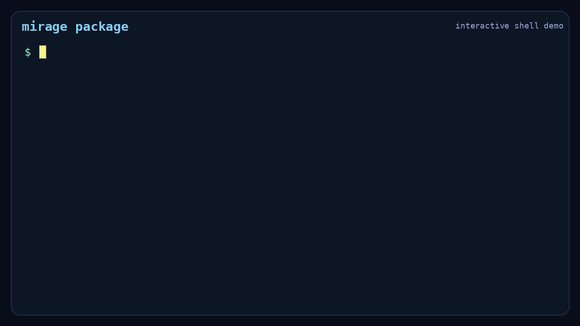

# mirage

`mirage` is a lightweight Linux sandbox launcher for local tools and agent
workloads. It is designed to be easier to set up than heavier sandbox or
container stacks while still providing useful filesystem, process, and
networking isolation on Linux. Mirage gives you a direct CLI for running one
foreground workload with explicit rootfs, bind mounts, network policy, and
optional cgroup limits.

## Demo

[](docs/assets/mirage-demo.mp4)

Open the demo above for a quick walkthrough of `mirage package`, `rootfs init`,
and an interactive `mirage run` session with `ps`, `ls`, `curl`, and `jq`.

## Why Mirage

- lightweight compared to full container or VM-based sandbox stacks
- practical filesystem and process isolation for local tools and agents
- workable network isolation with reviewable policy files and presets
- explicit rootfs and bind-mount configuration instead of hidden runtime behavior
- simple setup and direct CLI workflows

## Quick Start

On Debian or Ubuntu, install the required host tools:

```bash
sudo apt update
sudo apt install -y \
    util-linux \
    uidmap \
    iproute2 \
    iptables \
    systemd \
    ca-certificates \
    curl \
    tar \
    debian-archive-keyring \
    mmdebstrap
```

Mirage requires Go `1.24.4` or newer.

Check your installed version with:

```bash
go version
```

If your Go version is older than `1.24.4`, install a newer release from the
official Go downloads page:

```text
https://go.dev/dl/
```

Build Mirage:

```bash
git clone https://github.com/DemonGiggle/mirage.git
cd mirage
mkdir -p ./bin /tmp/mirage
go build -o ./bin/mirage ./cmd/mirage
```

The rest of the docs assume `mirage` resolves to this built binary and is
available in both your normal shell `PATH` and `sudo` command path. For
commands that require elevated privileges, use `sudo mirage ...`, not
`sudo go run ...`.

Verify the host:

```bash
mirage doctor
```

Generate and validate a basic rootfs:

```bash
sudo mirage rootfs init --output /tmp/mirage/basic-rootfs
mirage doctor --rootfs /tmp/mirage/basic-rootfs --command /bin/ls
```

Need extra Debian tools in the generated rootfs? Add them at bootstrap time:

```bash
sudo ./bin/mirage rootfs init --output /tmp/mirage/dev-rootfs --extra-pkg jq,vim,htop
```

If you need to generate a rootfs for a different target architecture such as
`arm64` on an `x86_64` host, see
[docs/rootfs-cross-arch.md](docs/rootfs-cross-arch.md) before running
`rootfs init --arch ...`.

Run a first sandboxed command:

```bash
sudo mirage run --rootfs /tmp/mirage/basic-rootfs --network-policy-file ./examples/network-policies/offline.yaml -- /bin/ls /
```

`rootfs init` currently requires `sudo`. `run` currently executes through
`sudo` as well.

If `rootfs init` fails because the Debian keyring is too old, update it
manually and retry:

```bash
wget http://deb.debian.org/debian/pool/main/d/debian-archive-keyring/debian-archive-keyring_2023.3+deb12u2_all.deb
sudo dpkg -i debian-archive-keyring_2023.3+deb12u2_all.deb
```

## Limits

- `mirage run` launches one direct foreground workload; it is not an init or
  orchestration system.
- Dedicated rootfs runs use `chroot`-based filesystem isolation, not a full
  container-style root filesystem switch. See
  [docs/architecture.md](docs/architecture.md) for details.
- `--rootfs /` is a convenience mode and does not provide a fresh filesystem or
  `/proc` view.
- Domain-backed network selectors are still intentionally unsupported.

## Docs

- [docs/usage.md](docs/usage.md): command reference and operator workflows
- [docs/rootfs.md](docs/rootfs.md): rootfs behavior and generation rules
- [docs/rootfs-cross-arch.md](docs/rootfs-cross-arch.md): host setup for `rootfs init --arch ...` on a different CPU architecture
- [docs/isolation.md](docs/isolation.md): current guarantees and caveats
- [docs/apps/openclaw.md](docs/apps/openclaw.md): short OpenClaw setup flow
- [docs/apps/hermes.md](docs/apps/hermes.md): short Hermes Agent setup flow
- [docs/cgroups.md](docs/cgroups.md): delegated memory and PID limits
- [docs/architecture.md](docs/architecture.md): runtime structure and run flow
- [docs/network-rule-model.md](docs/network-rule-model.md): network policy schema and semantics
- [docs/routed-networking.md](docs/routed-networking.md): routed uplink backend details
- [docs/development.md](docs/development.md): contributor workflow
