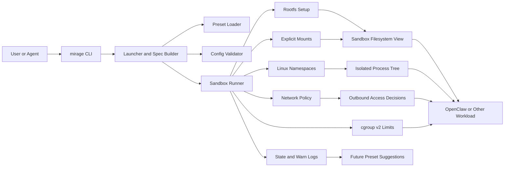
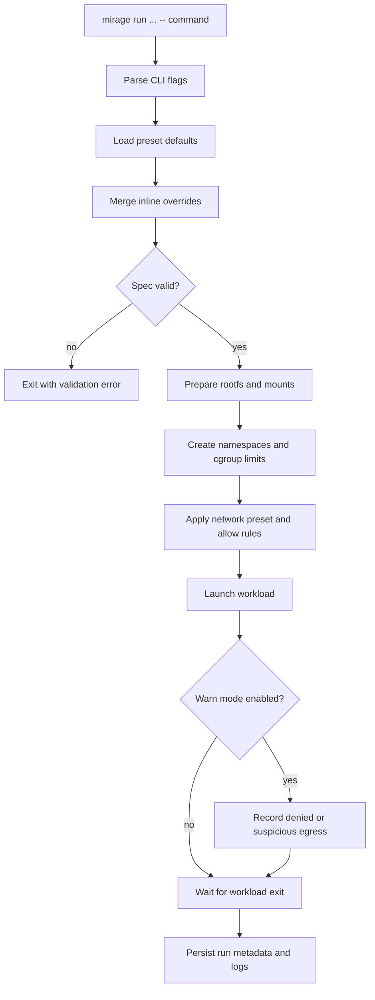

# Architecture

## Goals

`mirage` should make it easy to launch an application inside a narrow, explicit execution envelope:

- isolated root filesystem
- isolated process tree
- optionally isolated network stack
- explicit mount exposure
- host-visible workload log export
- constrained resources

The design target is not academic sandbox purity. The design target is a useful, repeatable isolation wrapper for local developer and agent workflows.

## Glossary

- `control plane`: the part of `mirage` that parses CLI input, resolves presets, validates options, and builds a final execution spec
- `sandbox backend`: the part of `mirage` that actually enforces isolation with Linux primitives such as namespaces, rootfs setup, mounts, network rules, and cgroups
- `host passthrough`: a fallback execution path where `mirage` performs planning and validation, but the final command still runs directly on the host without namespace isolation
- `isolated process tree`: the full set of processes started by the sandbox entrypoint, including all child and grandchild processes it later spawns
- `rootfs`: the filesystem tree exposed as `/` to the sandboxed process
- `bind mount`: an explicit mapping from a host path into the sandbox, usually read-only or read-write
- `network preset`: a named policy bundle that gives the sandbox a default network stance
- `warn mode`: an observation mode that records denied or suspicious accesses so they can later become allow rules or presets
- `host log export`: a mechanism for teeing workload stdout and stderr into host-visible files

These words are not just documentation jargon. They define the boundary between what `mirage` already does today and what the real isolation engine still needs to enforce.

## Architecture Diagram

The intended mental model is simple: `mirage` is a thin control plane in front of normal Linux isolation primitives. The CLI resolves a final spec, and the runner materializes that spec with namespaces, mounts, rootfs setup, network controls, and resource limits.

## Threat Model

V1 primarily tries to reduce risk from:

- an agent executing an unsafe command
- a plugin or subprocess reading more of the host than intended
- unwanted egress from a long-lived tool
- accidental host pollution from package installs, temp files, or helper binaries

V1 is not trying to defeat a determined kernel escape or a root-level adversary on the same host.

## Core Building Blocks

### 1. Launcher

The launcher parses CLI flags, resolves presets, validates mount requests, and builds a final sandbox spec.

Responsibilities:

- parse command-line options
- load preset defaults
- merge inline overrides
- validate incompatible settings
- emit a dry-run plan when requested

### 2. Isolation Setup

The runner uses Linux primitives rather than a custom container runtime:

- mount namespace
- PID namespace
- network namespace
- UTS namespace
- IPC namespace
- cgroup v2

For rootfs handling, the preferred direction is:

- bind or mount the prepared rootfs
- mount proc, tmpfs, and required runtime paths
- apply bind mounts
- switch root with `pivot_root` where practical

`chroot` can be used as an early fallback, but `pivot_root` is the cleaner long-term path.

The process model should stay explicit:

- one sandbox corresponds to one isolated process tree
- the entry command is only the root of that tree
- any subprocess spawned later should inherit the same sandbox boundary automatically

### 3. Filesystem Exposure

Host data should only enter the sandbox through explicit mounts.

Mount types:

- `ro-bind`: read-only host bind
- `rw-bind`: writable host bind
- `tmpfs`: ephemeral writable scratch

For OpenClaw, this matters a lot. A useful default profile would usually avoid mounting the whole `~/.openclaw` tree as writable.

### 3.5. Host Log Export

The host should be able to collect stdout and stderr from the workload even when the process is running inside a tighter envelope.

Early direction:

- allow explicit host-side stdout and stderr log targets
- keep log export opt-in rather than always-on
- preserve normal console output while teeing logs to files
- keep this mechanism stable so it survives the later namespace runner swap

### 4. Network Policy

The early network model should stay small:

- `none`
- `host`
- `isolated`

Inside `isolated`, policy can start with a small rule set generated from presets and inline allow items.

Initial rule vocabulary:

- allow TCP host:port
- allow IP or CIDR
- allow DNS or deny DNS

Domain-name allow lists are not a firewall primitive. They require name resolution, caching, and drift handling. That should stay out of the first implementation.

### 5. Warn Mode

Warn mode should help the user observe what would have been denied or what was attempted unexpectedly.

Early direction:

- log denied egress attempts
- tag logs with sandbox ID and destination metadata when available
- store observations under a local state directory

Possible future flow:

- `mirage run --warn net ...`
- collect blocked destinations
- `mirage preset suggest <sandbox-log>`

This is intentionally looser than a full "learning firewall", but it is enough to make preset design practical.

## Run Flow

This flow is deliberately narrow. The first version should feel like a predictable wrapper around one command, not a long-running orchestration layer.

## Presets

Presets should encode common operational stances rather than expose raw firewall implementation details.

Examples:

- `offline`: no network
- `openai`: allow minimal outbound traffic needed for OpenAI-backed agent work
- `github`: allow GitHub plus DNS
- `openclaw-dev`: bind common OpenClaw paths with a conservative network stance

Presets should be overridable by inline flags. Users will always need escape hatches.

## OpenClaw Integration Direction

The intended OpenClaw flow is:

1. prepare a rootfs once
2. mount only the needed working sets
3. run the gateway or selected jobs inside `mirage`
4. default to no network or a narrow preset
5. promote repeated observations into a named preset

## State

The project will likely need a small local state directory for:

- warn-mode network observations
- sandbox run metadata
- generated or user-defined presets

The state format should stay plain and inspectable.
