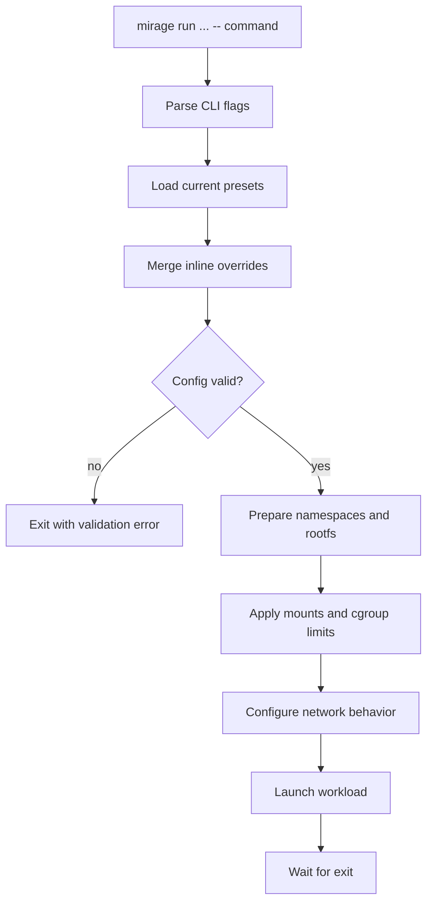

# Architecture

This document describes how `mirage` is structured internally. For operator
usage, see [usage.md](usage.md). For the exact user-visible isolation behavior,
see [isolation.md](isolation.md). For the canonical draft network policy model,
see [network-rule-model.md](network-rule-model.md).

## Design Goals

`mirage` should make it easy to launch an application inside a narrow,
repeatable execution envelope with:

- isolated process tree
- explicit filesystem exposure
- optional network isolation
- host-visible logs
- constrained resources

The goal is practical local sandboxing for developer and agent workflows, not
defense against a determined kernel-level adversary.

## Core Terms

- `control plane`: the CLI-facing layer that parses flags, resolves presets,
  validates options, and builds the final run specification
- `sandbox backend`: the Linux-specific execution layer that applies
  namespaces, rootfs setup, mounts, network behavior, and cgroups
- `rootfs`: the filesystem tree presented as `/` to the sandboxed process
- `rootfs template`: a reusable description of files, directories, and binaries
  that should exist in a generated rootfs
- `generated file`: a small file written directly into a generated rootfs, used
  for small runtime assets needed by a template
- `bind mount`: an explicit mapping from a host path into the sandbox, either
  read-only or read-write
- `preset file`: a file-backed bundle of default options layered on top of the
  underlying network-policy model

## Mental Model

The intended model is simple:

1. the CLI resolves a final config
2. the runner creates the requested isolation context
3. the workload executes inside that context
4. optional logs are persisted on the host

`mirage` is therefore a thin control plane in front of normal Linux isolation
primitives, not a custom container platform.

## High-Level Components

### CLI and Spec Resolution

The CLI is responsible for:

- parsing command-line flags
- loading the current built-in and file-backed presets
- resolving built-in rootfs templates where rootfs-oriented commands need them
- merging inline overrides
- validating incompatible or incomplete settings
- producing dry-run output

This layer decides what should happen. It does not enforce the sandbox itself.

### Runner

The runner is responsible for:

- creating user, PID, mount, UTS, and IPC namespaces
- selecting the concrete network backend implied by the resolved policy
- preparing runtime mounts such as `/proc`, `/tmp`, `/run`, and a managed `/dev`
  layout for dedicated rootfs runs
- applying bind mounts
- performing rootfs handoff
- entering delegated cgroup v2 limits when configured
- executing the final command

### State

The current implementation can persist:

- host-visible stdout and stderr logs

This state is intentionally plain and local rather than hidden behind a daemon.

## Current Runtime Construction

The backend currently builds the sandbox in this order:

1. create namespaces with `unshare`
2. prepare mount propagation when a separate mount layout is needed
3. mount `proc`, `tmpfs`, `run`, and a managed `/dev` layout under a non-`/`
   rootfs
4. apply read-only and read-write bind mounts
5. hand off into the rootfs with `chroot`
6. execute the workload directly

That sequencing explains an important current limitation:

- when `--rootfs /` is used, `mirage` does not create a fresh rootfs mount
  layout, so the host root remains visible and the existing `/proc` mount stays
  in place

The operator-visible consequences are documented in
[isolation.md](isolation.md).

## Namespace Model

One `mirage run` invocation corresponds to one isolated process tree.

The workload root process and any later child processes should inherit the same
namespace boundary automatically. This is the main reason the implementation
uses standard Linux namespace setup rather than a host-side subprocess wrapper.

## Network Model

The current network backend intentionally supports only a narrow subset of the
full policy model:

- allow-all policy: host namespace passthrough
- deny-only IP/CIDR policy: separate network namespace with loopback, ingress,
  and egress enforced by ordered packet-filter rules
- routed IP/CIDR policy with egress allow semantics: separate network
  namespace plus a host-managed veth uplink, forwarding/NAT, and ordered
  packet-filter rules
- domain-backed selectors: explicit unsupported errors

This keeps the public surface policy-first while still failing closed when the
current backend cannot enforce a requested rule shape.

## Rootfs Direction

The longer-term rootfs direction remains:

- define reusable rootfs templates that stay separate from network-policy design
- prepare a dedicated rootfs
- mount required runtime paths explicitly
- apply bind mounts
- switch root with `pivot_root` where practical

Current state:

- non-`/` rootfs runs get a prepared runtime layout
- handoff still finishes with `chroot`
- `--rootfs /` remains a convenience mode, not a strong rootfs boundary

## Cgroup Direction

The backend currently supports delegated cgroup v2 limits for:

- memory
- PID count

This keeps the resource model narrow and useful without introducing a full
resource-management layer.

Mirage reaches those limits in two steps:

1. `systemd-run --user --scope -p Delegate=yes` creates a delegated systemd
   scope that the current user is allowed to manage
2. Mirage creates a child cgroup inside that scope and writes `memory.max`,
   `memory.swap.max`, and `pids.max` directly

That split is intentional: `systemd-run` provides delegated ownership of the
subtree, while cgroup v2 file writes perform the actual kernel limit
enforcement. For the detailed rationale and execution sketch, see
[cgroups.md](cgroups.md).

## Run Flow

## Relationship To Other Docs

- [usage.md](usage.md) explains how to invoke the CLI
- [isolation.md](isolation.md) explains what isolation properties users should
  expect today
- [cgroups.md](cgroups.md) explains delegated systemd scopes, leaf cgroup
  creation, and resource-limit enforcement
- [network-rule-model.md](network-rule-model.md) defines the draft future
  rule-first network policy model
- [roadmap.md](roadmap.md) tracks the remaining implementation work
