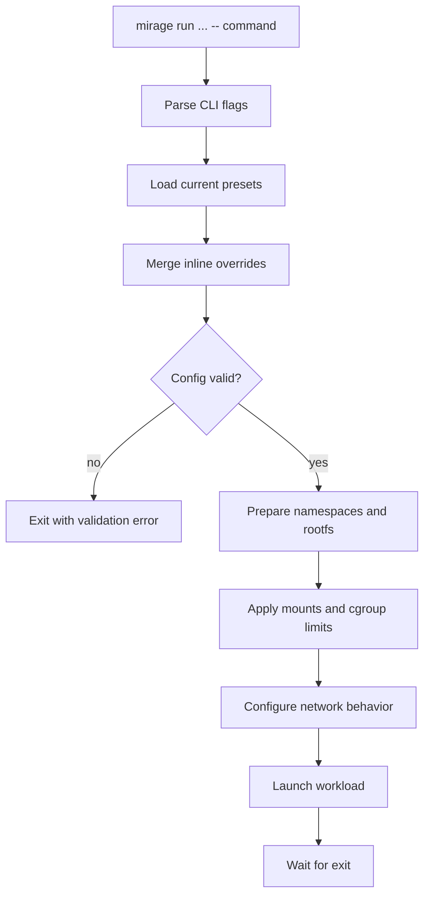

# Architecture

This document describes how `mirage` is structured internally. For operator
usage, see [usage.md](usage.md). For the exact user-visible isolation behavior,
see [isolation.md](isolation.md). For the canonical draft network policy model,
see [network-rule-model.md](network-rule-model.md).

## Design Goals

`mirage` should make it easy to launch an application inside a narrow,
repeatable execution envelope with:

- isolated process tree
- explicit filesystem exposure
- optional network isolation
- host-visible logs
- constrained resources

The goal is practical local sandboxing for developer and agent workflows, not
defense against a determined kernel-level adversary.

## Core Terms

- `control plane`: the CLI-facing layer that parses flags, resolves presets,
  validates options, and builds the final run specification
- `sandbox backend`: the Linux-specific execution layer that applies
  namespaces, rootfs setup, mounts, network behavior, and cgroups
- `rootfs`: the filesystem tree presented as `/` to the sandboxed process
- `rootfs template`: a reusable description of files, directories, and binaries
  that should exist in a generated rootfs
- `generated file`: a small file written directly into a generated rootfs, used
  for assets such as an empty machine-id or future service-unit scaffolding
- `bind mount`: an explicit mapping from a host path into the sandbox, either
  read-only or read-write
- `preset`: a named bundle of current default options; this is a transitional
  CLI convenience layer rather than the long-term network-policy shape
- `runtime mode`: whether Mirage launches a direct workload entrypoint or an
  init-oriented entrypoint that must become sandbox PID 1

## Mental Model

The intended model is simple:

1. the CLI resolves a final config
2. the runner creates the requested isolation context
3. the direct workload or guest init entrypoint executes inside that context
4. optional logs are persisted on the host

`mirage` is therefore a thin control plane in front of normal Linux isolation
primitives, not a custom container platform.

## High-Level Components

### CLI and Spec Resolution

The CLI is responsible for:

- parsing command-line flags
- loading the current built-in and file-backed presets
- resolving built-in rootfs templates where rootfs-oriented commands need them
- merging inline overrides
- validating incompatible or incomplete settings
- producing dry-run output

This layer decides what should happen. It does not enforce the sandbox itself.

### Runner

The runner is responsible for:

- creating user, PID, mount, UTS, and IPC namespaces
- creating a network namespace when requested
- preparing runtime mounts such as `/proc`, `/tmp`, and `/run`
- applying bind mounts
- performing rootfs handoff
- entering delegated cgroup v2 limits when configured
- executing the final command according to the selected runtime mode

### State

The current implementation can persist:

- host-visible stdout and stderr logs

This state is intentionally plain and local rather than hidden behind a daemon.

## Current Runtime Construction

The backend currently builds the sandbox in this order:

1. create namespaces with `unshare`
2. prepare mount propagation when a separate mount layout is needed
3. mount `proc`, `tmpfs`, and `run` under a non-`/` rootfs
4. apply read-only and read-write bind mounts
5. hand off into the rootfs with `chroot`
6. execute the workload directly, or hand off to a guest init entrypoint when
   init mode is selected

That sequencing explains an important current limitation:

- when `--rootfs /` is used, `mirage` does not create a fresh rootfs mount
  layout, so the host root remains visible and the existing `/proc` mount stays
  in place

The operator-visible consequences are documented in
[isolation.md](isolation.md).

## Namespace Model

One `mirage run` invocation corresponds to one isolated process tree.

The workload root process and any later child processes should inherit the same
namespace boundary automatically. This is the main reason the implementation
uses standard Linux namespace setup rather than a host-side subprocess wrapper.

## Runtime Modes

Mirage now distinguishes between two runtime modes:

- `direct`: the requested workload is launched as the sandbox entrypoint and
  becomes PID 1
- `init`: the requested guest init binary becomes sandbox PID 1 directly, which
  is the shape needed for guest `systemd`

The current init-mode contract is intentionally narrow:

- it preserves a true guest PID 1 handoff
- it does not yet add a Mirage supervisor above that init process
- it shares the same current coarse `host` / `none` network surface as direct mode
- it assumes a unified cgroup v2 host and always enters a delegated
  `systemd-run --user --scope` leaf before guest init starts
- it currently requires a dedicated rootfs, because host-root mode keeps the
  inherited `/sys/fs/cgroup` mount instead of a guest-private cgroup mount
- it unshares a cgroup namespace and exposes `/sys/fs/cgroup` inside dedicated
  rootfs runs so guest init sees a writable delegated subtree
- it layers extra init-only mounts over the base runtime layout: a managed
  `/dev`, a guest-private read-only `/sys`, and runtime state directories under
  `/run`

## Tracked Sandbox Lifecycle

Issue #33 adds a thin lifecycle layer for guest-systemd sandboxes without
turning Mirage into a daemon.

The model is:

1. `mirage sandbox start` resolves the final init-mode config and validates the
   rootfs
2. Mirage assigns a stable user-systemd scope unit name
3. Mirage backgrounds the existing `mirage run` flow and persists local sandbox
   state
4. later host-side commands (`status`, `stop`, `logs`) operate against that
   recorded state and the named user-systemd scope

Important consequences:

- stop semantics are tied to the named `systemd-run --user --scope` unit rather
  than to a wrapper PID
- the persisted state is plain local JSON plus log files in the user's state
  directory
- stdout/stderr log export is the primary host-visible log surface for this
  lifecycle model today
- init-mode runs advertise themselves to guest init processes with
  `container=mirage`
- Mirage still does not inject a supervisor *inside* the guest; guest `systemd`
  remains PID 1 in the sandbox
- Mirage still does not provide a general live namespace-entry API for running
  follow-up commands inside an already-running sandbox

## Network Model

The current network modes are intentionally small:

- `host`: no network namespace isolation
- `none`: separate network namespace with no network access

Anything richer than that is intentionally deferred. The current `--net` and
`preset` surface should be treated as transitional compatibility while the
rule-based network model is designed. Future firewall, diagnostics, and policy
composition work should be rebuilt on top of that new model rather than
inherited from the removed observed-policy surface.

## Rootfs Direction

The longer-term rootfs direction remains:

- define reusable rootfs templates that stay separate from network-policy design
- prepare a dedicated rootfs
- mount required runtime paths explicitly
- apply bind mounts
- switch root with `pivot_root` where practical

Current state:

- non-`/` rootfs runs get a prepared runtime layout
- handoff still finishes with `chroot`
- `--rootfs /` remains a convenience mode, not a strong rootfs boundary

## Cgroup Direction

The backend currently supports delegated cgroup v2 limits for:

- memory
- PID count

This keeps the resource model narrow and useful without introducing a full
resource-management layer.

## Run Flow

## Relationship To Other Docs

- [usage.md](usage.md) explains how to invoke the CLI
- [isolation.md](isolation.md) explains what isolation properties users should
  expect today
- [network-rule-model.md](network-rule-model.md) defines the draft future
  rule-first network policy model
- [roadmap.md](roadmap.md) tracks the remaining implementation work
